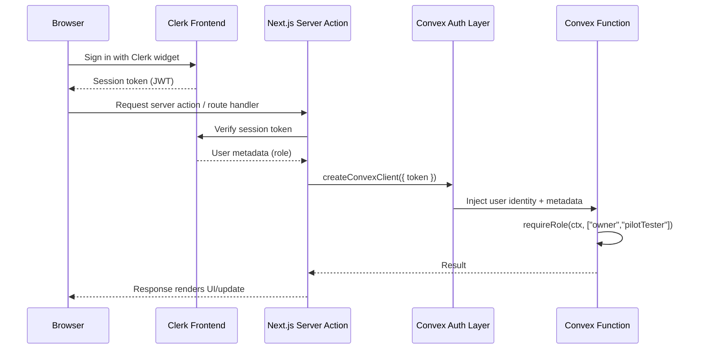

# Backend Architecture

## Function Organization

```text
packages/convex/
├─ schema.ts                  # Define tables, indexes, auth base
├─ auth.ts                    # Clerk session parsing & role guard helpers
├─ products.ts                # Product mutations/queries
├─ sales.ts                   # Sale capture, variance flagging, report helpers
├─ insights.ts                # Insight ingestion, latest/history queries
├─ feedback.ts                # Feedback submission + moderation
├─ reports.ts                 # Aggregation helpers reused by server actions
├─ cron.ts                    # Optional scheduled maintenance jobs
├─ n8n.ts                     # Shared validation for webhook payloads
└─ _generated/
   ├─ api.ts
   └─ dataModel.ts
```

## Function Template

```typescript
import { mutation } from "./_generated/server";
import { v } from "convex/values";
import { requireRole } from "./auth";
import { SaleEventSchema } from "@seraphine/shared/schemas";

export const createSale = mutation({
  args: {
    items: v.array(
      v.object({
        productId: v.id("products"),
        quantity: v.number(),
        unitPriceCents: v.number(),
        barcode: v.string(),
        name: v.string(),
      })
    ),
    tender: v.object({
      method: v.union(v.literal("cash"), v.literal("card"), v.literal("other")),
      amountCents: v.number(),
      notes: v.optional(v.string()),
    }),
    feedbackOptIn: v.boolean(),
  },
  handler: async (ctx, args) => {
    const user = await requireRole(ctx, ["pilotTester", "owner"]);
    const sale = SaleEventSchema.parse({
      operatorId: user.id,
      occurredAt: new Date().toISOString(),
      feedbackPrompted: args.feedbackOptIn,
      ...args,
    });
    const saleId = await ctx.db.insert("sales", sale);
    return { id: saleId };
  },
});
```

## Schema Design (Convex)

```typescript
import { defineSchema, defineTable } from "convex/server";
import { v } from "convex/values";

export default defineSchema({
  products: defineTable({
    barcode: v.string(),
    name: v.string(),
    priceCents: v.number(),
    taxCode: v.string(),
    notes: v.optional(v.string()),
    updatedBy: v.string(),
    updatedAt: v.string(),
  })
    .index("byBarcode", ["barcode"])
    .searchIndex("byName", { searchField: "name" }),

  sales: defineTable({
    operatorId: v.string(),
    occurredAt: v.string(),
    items: v.array(
      v.object({
        productId: v.id("products"),
        barcode: v.string(),
        name: v.string(),
        quantity: v.number(),
        unitPriceCents: v.number(),
      })
    ),
    tender: v.object({
      method: v.union(v.literal("cash"), v.literal("card"), v.literal("other")),
      amountCents: v.number(),
      notes: v.optional(v.string()),
    }),
    varianceFlag: v.optional(v.boolean()),
    feedbackPrompted: v.boolean(),
  })
    .index("byOccurredAt", ["occurredAt"])
    .index("byOperator", ["operatorId", "occurredAt"])
    .index("byVariance", ["varianceFlag", "occurredAt"]),

  insights: defineTable({
    category: v.union(
      v.literal("cashVariance"),
      v.literal("topSeller"),
      v.literal("watchlist")
    ),
    title: v.string(),
    details: v.string(),
    generatedAt: v.string(),
    sourceRunId: v.string(),
    confidence: v.optional(v.number()),
    relatedSales: v.optional(v.array(v.id("sales"))),
  })
    .index("byCategory", ["category", "generatedAt"])
    .uniqueIndex("bySourceRun", ["sourceRunId"]),

  feedback: defineTable({
    submittedBy: v.string(),
    scope: v.union(
      v.literal("dashboard"),
      v.literal("pos"),
      v.literal("salesLog"),
      v.literal("settings")
    ),
    sentiment: v.union(v.literal("positive"), v.literal("neutral"), v.literal("negative")),
    message: v.string(),
    createdAt: v.string(),
    relatedSaleId: v.optional(v.id("sales")),
  })
    .index("byScope", ["scope", "createdAt"])
    .index("bySubmitter", ["submittedBy", "createdAt"])
    .index("bySentiment", ["sentiment", "createdAt"]),

  user_profiles: defineTable({
    role: v.union(v.literal("owner"), v.literal("pilotTester")),
    displayName: v.string(),
    email: v.string(),
    lastActiveAt: v.string(),
  }),
});
```

## Data Access Layer

```typescript
import { api } from "@seraphine/convex/_generated/api";
import { convexServerClient } from "./convex-server-client";
import type { SaleEvent } from "../types";

export async function listSalesByDateRange(args: { start: string; end: string; operatorId?: string }) {
  return convexServerClient.query(api.sales.listByDateRange, args);
}

export async function flagVariance(args: { saleId: string; reason: string }) {
  return convexServerClient.mutation(api.sales.flagVariance, args);
}

export async function generateReportData(date: string): Promise<SaleEvent[]> {
  return convexServerClient.query(api.reports.dailySnapshot, { date });
}
```

## Data Migration & Recovery

- **Seeding:** `scripts/seed-pilot.ts` (planned) will hydrate Convex with pilot catalog/products and baseline users via `convex import`, sourcing CSVs from `docs/pilot/seed`.  
- **Backups:** Convex automated daily snapshots retained for 30 days; production environment configured to trigger manual snapshot before major releases.  
- **Recovery:** `scripts/restore-snapshot.ts` (planned) wraps Convex CLI to restore snapshots and redeploy functions automatically; on-call roster rotates monthly. Detailed procedure in `docs/runbooks/convex-recovery.md`.  
- **Audit Logging:** Report downloads and n8n ingestion failures recorded in dedicated collections for traceability.
- **Retention & Purge:** Pilot data retained for 12 months; `scripts/purge-pilot.ts` (planned) will archive/export CSVs before deleting aged records to maintain compliance with internal policies.

## Authentication Architecture



```typescript
import { MutationCtx, QueryCtx } from "./_generated/server";

type Role = "owner" | "pilotTester";

export async function requireRole(ctx: MutationCtx | QueryCtx, allowed: Role[]) {
  const identity = await ctx.auth.getUserIdentity();
  if (!identity) {
    throw new Error("AUTH_UNAUTHENTICATED");
  }

  const profile = await ctx.db.get(identity.subject as any);
  const role = (profile?.role ?? identity.token?.metadata?.role) as Role | undefined;

  if (!role || !allowed.includes(role)) {
    throw new Error("AUTH_FORBIDDEN");
  }

  return { id: identity.subject, role, email: profile?.email ?? identity.email };
}
```
