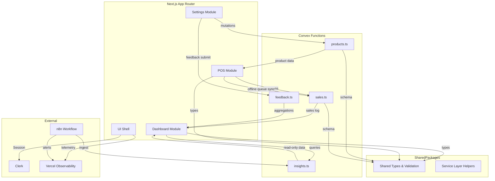

# Components

## Component Responsibilities

**User Interface Shell**  
Responsibility: Next.js App Router layout, navigation rail, shared UI primitives (shadcn/ui), localization, and Clerk session bootstrap.  
Key Interfaces: `AppShell` layout component; `useUser()` Clerk hook.  
Dependencies: Tailwind theme tokens, Clerk Provider, Convex client initialization.  
Technology Stack: Next.js 14 App Router, shadcn/ui, Tailwind CSS, Clerk SDK.

**POS Workflow Module**  
Responsibility: Capture barcode sales, manage scanner diagnostics, orchestrate mutations to `sales.createSale`, and queue offline entries.  
Key Interfaces: `ScanPane` component; `usePosSession()` Zustand store.  
Dependencies: Convex `products.lookupByBarcode`, `sales.createSale`, UI Shell.  
Technology Stack: React client components, Convex React hooks, Zustand, Clerk auth guard.

**Dashboard Insights Module**  
Responsibility: Render AI insight cards, freshness badges, and detailed drawers sourced from `insights.listLatest`.  
Key Interfaces: `useInsights()` query hook; `InsightCard` component.  
Dependencies: Convex data layer, n8n-populated documents, Vercel analytics events, config flag for stale-data banner.
Technology Stack: Next.js server components, Convex React hooks, shadcn/ui.

**Catalog & Settings Module**  
Responsibility: Manage product CRUD and feedback views with role-restricted access.  
Key Interfaces: `ProductTable`, `ProductForm` server action.  
Dependencies: Convex mutations, Clerk roles, shared validation schemas.  
Technology Stack: Server actions, Convex mutations, Zod validation.

**Convex Data & Service Layer**  
Responsibility: Owns schemas for products, sales, insights, and feedback; exposes typed queries/mutations; enforces auth checks.  
Key Interfaces: `products.ts`, `sales.ts`, `insights.ts`, `feedback.ts`, `auth.ts`.  
Dependencies: Clerk JWT claims, Convex scheduler, n8n webhooks.  
Technology Stack: Convex serverless functions (TypeScript).

**AI Integration Pipeline (n8n)**  
Responsibility: Pull pilot data, enrich with AI scoring, and write read-only `AIInsight` records into Convex via service key.  
Key Interfaces: n8n HTTP request nodes calling Convex ingestion mutation.  
Dependencies: Convex service token, environment secrets, monitoring.  
Technology Stack: n8n Cloud workflow, Convex service clients.

**Reporting & Export Service**  
Responsibility: Generate CSV/PDF snapshots via Next.js server actions streaming data from Convex queries.  
Key Interfaces: `generateDailyReport` server action; `reports.generateDaily` Convex helper.  
Dependencies: Convex list queries, Vercel streaming, shared CSV/PDF utilities.  
Technology Stack: Next.js Route Handlers/Server Actions, Convex queries.

## Component Diagram

