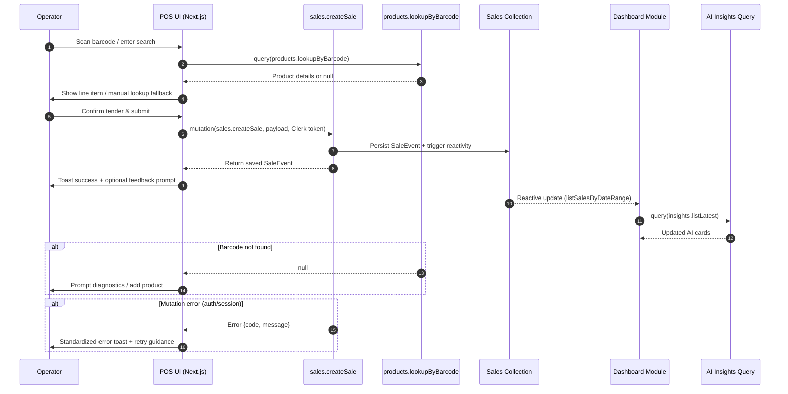
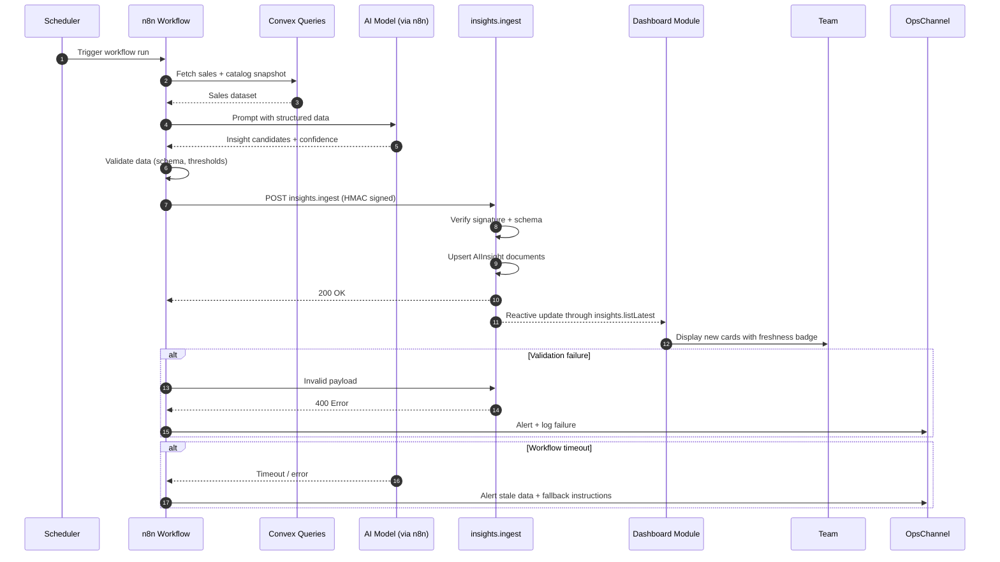
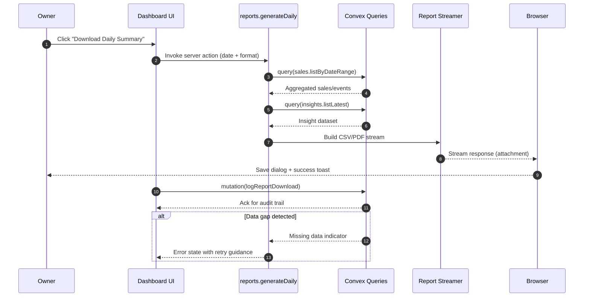

# Core Workflows

## POS Barcode Sale Capture

```mermaid
sequenceDiagram
    autonumber
    participant Operator
    participant POS_UI as POS UI (Next.js)
    participant ConvexSales as sales.createSale
    participant ConvexProducts as products.lookupByBarcode
    participant ConvexEvents as Sales Collection
    participant Dashboard as Dashboard Module
    participant Insights as AI Insights Query

    Operator->>POS_UI: Scan barcode / enter search
    POS_UI->>ConvexProducts: query(products.lookupByBarcode)
    ConvexProducts-->>POS_UI: Product details or null
    POS_UI->>Operator: Show line item / manual lookup fallback
    Operator->>POS_UI: Confirm tender & submit
    POS_UI->>ConvexSales: mutation(sales.createSale, payload, Clerk token)
    ConvexSales->>ConvexEvents: Persist SaleEvent + trigger reactivity
    ConvexSales-->>POS_UI: Return saved SaleEvent
    POS_UI->>Operator: Toast success + optional feedback prompt
    ConvexEvents-->>Dashboard: Reactive update (listSalesByDateRange)
    Dashboard->>Insights: query(insights.listLatest)
    Insights-->>Dashboard: Updated AI cards

    alt Barcode not found
        ConvexProducts-->>POS_UI: null
        POS_UI->>Operator: Prompt diagnostics / add product
    end

    alt Mutation error (auth/session)
        ConvexSales-->>POS_UI: Error {code, message}
        POS_UI->>Operator: Standardized error toast + retry guidance
    end
```

## AI Insight Synchronization

```mermaid
sequenceDiagram
    autonumber
    participant Scheduler as Scheduler
    participant n8n as n8n Workflow
    participant ConvexRead as Convex Queries
    participant OpenAI as AI Model (via n8n)
    participant ConvexIngest as insights.ingest
    participant Dashboard as Dashboard Module

    Scheduler->>n8n: Trigger workflow run
    n8n->>ConvexRead: Fetch sales + catalog snapshot
    ConvexRead-->>n8n: Sales dataset
    n8n->>OpenAI: Prompt with structured data
    OpenAI-->>n8n: Insight candidates + confidence
    n8n->>n8n: Validate data (schema, thresholds)
    n8n->>ConvexIngest: POST insights.ingest (HMAC signed)
    ConvexIngest->>ConvexIngest: Verify signature + schema
    ConvexIngest->>ConvexIngest: Upsert AIInsight documents
    ConvexIngest-->>n8n: 200 OK
    ConvexIngest-->>Dashboard: Reactive update through insights.listLatest
    Dashboard->>Team: Display new cards with freshness badge

    alt Validation failure
        n8n->>ConvexIngest: Invalid payload
        ConvexIngest-->>n8n: 400 Error
        n8n->>OpsChannel: Alert + log failure
    end

    alt Workflow timeout
        OpenAI-->>n8n: Timeout / error
        n8n->>OpsChannel: Alert stale data + fallback instructions
    end
```

## Daily Report Export

```mermaid
sequenceDiagram
    autonumber
    participant Owner
    participant Dashboard as Dashboard UI
    participant ServerAction as reports.generateDaily
    participant ConvexReports as Convex Queries
    participant Streamer as Report Streamer
    participant Browser as Browser

    Owner->>Dashboard: Click "Download Daily Summary"
    Dashboard->>ServerAction: Invoke server action (date + format)
    ServerAction->>ConvexReports: query(sales.listByDateRange)
    ConvexReports-->>ServerAction: Aggregated sales/events
    ServerAction->>ConvexReports: query(insights.listLatest)
    ConvexReports-->>ServerAction: Insight dataset
    ServerAction->>Streamer: Build CSV/PDF stream
    Streamer-->>Browser: Stream response (attachment)
    Browser-->>Owner: Save dialog + success toast
    Dashboard->>ConvexReports: mutation(logReportDownload)
    ConvexReports-->>Dashboard: Ack for audit trail

    alt Data gap detected
        ConvexReports-->>ServerAction: Missing data indicator
        ServerAction-->>Dashboard: Error state with retry guidance
    end
```
