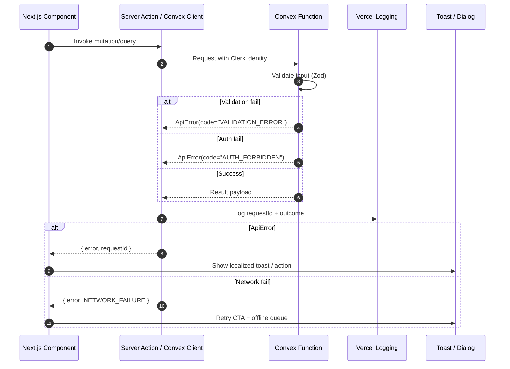

# Error Handling Strategy



```typescript
interface ApiError {
  error: {
    code: string;
    message: string;
    details?: Record<string, any>;
    timestamp: string;
    requestId: string;
  };
}
```

```typescript
type ApiErrorPayload = {
  error?: {
    code: string;
    message: string;
    details?: Record<string, unknown>;
    requestId?: string;
  };
};

const errorCopy: Record<string, string> = {
  AUTH_FORBIDDEN: "Vous n'avez pas accès à cette fonctionnalité.",
  VALIDATION_ERROR: "Données invalides. Merci de vérifier le formulaire.",
  NETWORK_FAILURE: "Connexion interrompue. Réconnexion en cours...",
  DEFAULT: "Une erreur est survenue. Réessayez dans quelques instants.",
};

export function handleApiError(payload: ApiErrorPayload, fallbackMessage?: string) {
  const code = payload.error?.code ?? "DEFAULT";
  const message = fallbackMessage ?? errorCopy[code] ?? errorCopy.DEFAULT;

  toast({
    title: "Oups…",
    description: message,
    variant: code === "NETWORK_FAILURE" ? "warning" : "destructive",
    action:
      code === "NETWORK_FAILURE"
        ? {
            label: "Réessayer",
            onClick: () => window.location.reload(),
          }
        : undefined,
  });

  if (payload.error?.requestId) {
    console.error(`Request ${payload.error.requestId} failed`, payload.error.details);
  }
}
```

```typescript
export class ApiError extends Error {
  constructor(
    public readonly code:
      | "AUTH_FORBIDDEN"
      | "AUTH_UNAUTHENTICATED"
      | "VALIDATION_ERROR"
      | "NOT_FOUND"
      | "RATE_LIMITED",
    message: string,
    public readonly details?: Record<string, unknown>
  ) {
    super(message);
    this.name = "ApiError";
  }
}

export function toErrorPayload(error: unknown) {
  const timestamp = new Date().toISOString();
  const requestId = crypto.randomUUID();

  if (error instanceof ApiError) {
    return {
      error: {
        code: error.code,
        message: error.message,
        details: error.details,
        timestamp,
        requestId,
      },
    };
  }

  console.error("Unhandled server error", error);
  return {
    error: {
      code: "INTERNAL_SERVER_ERROR",
      message: "Unexpected server error",
      timestamp,
      requestId,
    },
  };
}
```
