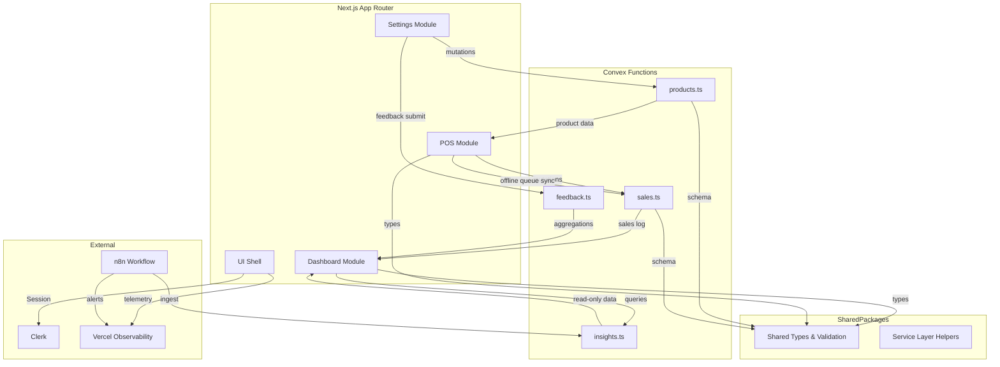
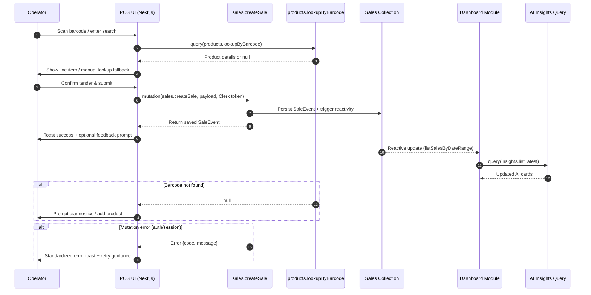
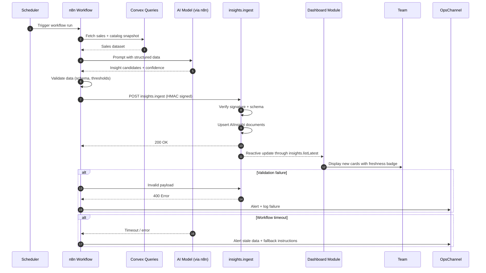
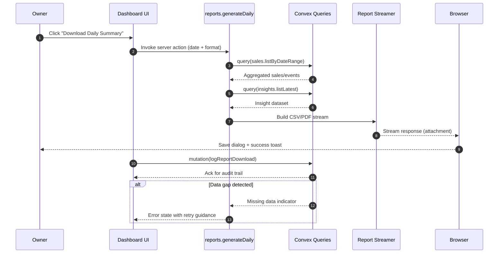
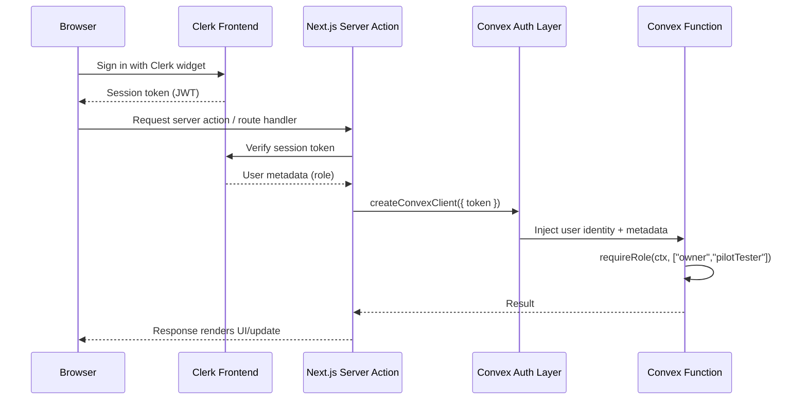
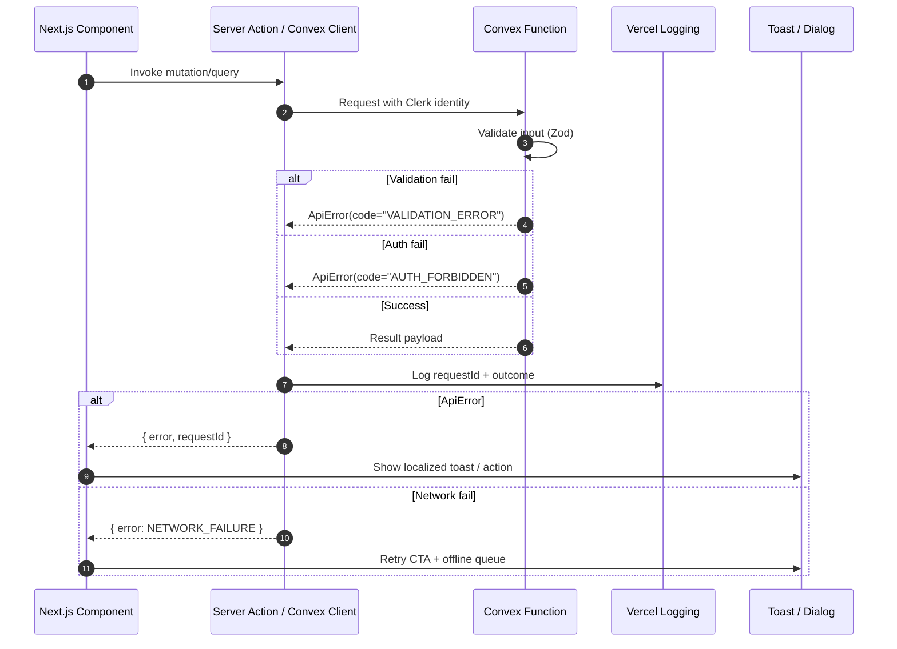

# Seraphine Fullstack Architecture Document

## Introduction

This document defines the fullstack architecture for Seraphine, unifying the Next.js App Router frontend, Convex data layer, and supporting services into a single source of truth for AI-assisted development. It explains how the POS barcode workflow, AI-generated insights pipeline, and reporting surfaces cooperate across the stack so every AI or human contributor can reason about the same constraints. The guidance emphasizes rapid internal pilot iteration, observable deployments on Vercel, and tight feedback cycles around the n8n enrichment workflow while leaving room for future external launches.

### Starter Template or Existing Project

N/A – Greenfield project. We will scaffold from the standard Next.js 14 App Router starter with pnpm workspaces, then layer in Convex, Clerk, Tailwind, and shadcn/ui per the PRD. No legacy repository constraints exist, so the architecture can optimize for the MVP stack from day one.

### Change Log

| Date       | Version | Description                             | Author    |
|------------|---------|-----------------------------------------|-----------|
| 2025-10-28 | 0.1     | Initial fullstack architecture baseline | Architect |

## High Level Architecture

### Technical Summary

Seraphine runs as a monorepo Next.js 14 application hosted on Vercel, using the App Router to serve both interactive UI and backend APIs. Convex supplies the operational data tier, enabling strongly typed mutations for POS transactions while exposing reactive queries that keep dashboard insights live. Clerk handles authentication and role enforcement across server actions and route handlers, ensuring all pilot features remain internal-only. n8n operates as an external automation workflow that ingests pilot data, enriches it with AI, and writes read-only insight records back into Convex for the dashboard. Infrastructure relies on Vercel’s managed edge plus Convex’s serverless deployment with environment parity between preview and production. Observatory hooks—Vercel analytics, Convex logs, and Sentry—provide end-to-end visibility so the team can iterate quickly without overbuilding.

### Platform and Infrastructure Choice

**Platform:** Vercel + Convex + Clerk + n8n  
**Key Services:** Vercel (Next.js hosting, deploy previews, edge cache); Convex (database and backend functions); Clerk (auth, role management); n8n Cloud (AI workflow orchestration); Vercel Analytics; Logtail for structured logs.  
**Deployment Host and Regions:** Vercel (iad1 primary) and Convex (iad1) with n8n in the same geography to minimize latency.

| Option                    | Pros                                                                                     | Cons / Trade-offs                                                                 | Decision |
|---------------------------|-------------------------------------------------------------------------------------------|-----------------------------------------------------------------------------------|----------|
| Vercel + Convex (Chosen)  | Optimized for Next.js 14, typed Convex client, minimal ops, fast preview deploys          | Vendor coupling; Convex learning curve                                           | ✅       |
| AWS Amplify + DynamoDB    | Enterprise-grade flexibility, native IAM controls                                        | More boilerplate (Lambda/API Gateway), slower MVP velocity                        | ❌       |
| Supabase + Next.js        | Excellent DX, SQL tooling                                                                 | Less native support for reactive queries than Convex; diverges from agreed stack | ❌       |

### Repository Structure

Adopt a pnpm-powered monorepo to keep frontend, Convex backend functions, shared schemas, and tooling cohesive:

```
seraphine/
├─ apps/
│  └─ web/                 # Next.js 14 App Router application
├─ packages/
│  ├─ api-clients/         # Typed fetch wrappers for server actions
│  ├─ convex/              # Convex schema, mutations, queries
│  ├─ shared/              # Zod schemas, domain types, utilities
│  └─ ui/                  # Tailwind/shadcn component extensions
├─ tooling/
│  ├─ eslint-config/       # Shared lint rules
│  └─ playwright/          # E2E test setup
├─ docs/                   # Architecture, PRD, story docs
└─ .github/                # Actions workflows
```

### Architectural Patterns

- **Serverless Fullstack with BFF Routing:** Next.js App Router plus Convex functions operate as a backend-for-frontend, keeping latency low and avoiding a separate API gateway. _Rationale:_ Matches the PRD’s single codebase mandate and simplifies auth, logging, and deployments for the pilot scale.
- **Component-Driven UI with Co-located Data Hooks:** Components live alongside Convex query hooks, ensuring dashboard and POS screens stay reactive without manual cache wiring. _Rationale:_ Reduces duplicated fetch logic and keeps scan flows responsive to inventory changes.
- **Domain-Oriented Packages:** Shared types, service helpers, and validation live in `packages/shared` and `packages/convex`, enforcing a single source for schema definitions. _Rationale:_ Prevents drift between frontend forms and backend mutations while giving AI agents clear import paths.
- **Structured Error Pipeline:** Server actions and Convex mutations throw typed errors wrapped by a common handler, and the frontend surfaces them via standardized toasts/modals. _Rationale:_ Guarantees predictable UX during barcode or AI sync failures and lays groundwork for observability.
- **Event Log & Reactive Streaming:** Sales capture emits append-only events in Convex that dashboards subscribe to. _Rationale:_ Allows real-time updates without polling and later enables audit/history views with minimal redesign.

## Tech Stack

| Category             | Technology                                   | Version         | Purpose                                                                | Rationale                                                                                                              |
|----------------------|-----------------------------------------------|-----------------|------------------------------------------------------------------------|------------------------------------------------------------------------------------------------------------------------|
| Frontend Language    | TypeScript                                    | 5.6.3           | Shared typing across UI, server actions, and Convex clients            | PRD standardizes on TypeScript-first tooling; keeps schemas consistent across packages.                                |
| Frontend Framework   | Next.js (App Router)                          | 14.2.5          | Unified frontend + backend routes on Vercel                            | Explicitly called out in PRD as the single application framework and deployment target.                                |
| UI Component Library | shadcn/ui                                     | 0.9.2          | Accessible component primitives on top of Tailwind                     | Matches PRD design system choice and accelerates internal MVP styling.                                                 |
| CSS Framework        | Tailwind CSS                                  | 3.4.13          | Utility-first styling layer for shadcn/ui components                   | Directly referenced in PRD; keeps design tokens centralized.                                                           |
| State Management     | Convex React hooks / Zustand                  | 1.14.0 / 4.5.2  | Reactive server data + transient POS session state                     | Convex handles live server data per PRD; Zustand limited to scanner/tender workflow without extra libs.                |
| Backend Language     | TypeScript                                    | 5.6.3           | Convex functions and Next.js server code                               | Single language across stack reduces context switching; matches PRD.                                                   |
| Backend Framework    | Convex + Next.js Server Actions               | 1.14.0 / 14.2.5 | Typed mutations/queries and server orchestration                       | Exactly how PRD describes data + API layer; no separate Express or Lambda needed.                                      |
| API Style            | Convex RPC                                    | 1.14.0          | Backend-for-frontend contract                                          | Removes need for standalone REST API; aligns with PRD’s “Next.js as backend” statement.                                |
| Database             | Convex Managed Store                          | 1.14.0          | Operational data, sales events, AI insights                            | PRD specifies Convex for persistence and reactive queries.                                                             |
| Cache                | Convex query caching + Next.js revalidate tags| Managed         | Leverage built-in caching; no standalone cache service                 | Keeps scope minimal per MVP; documents that no Redis or Supabase cache is introduced.                                  |
| File Storage         | On-demand streaming via server actions        | N/A             | Generate CSV/PDF exports at request time                               | Exports stream directly; persistent blob storage is out of MVP scope.                                                  |
| Authentication       | Clerk                                         | 5.7.2           | Auth, roles, pilot access control                                      | Mandated in PRD as sole identity provider.                                                                             |
| Automation Pipeline  | n8n Cloud workflow                            | 1.52.0         | Produce AI insights and sync into Convex                               | Core requirement in PRD for AI-powered dashboard content.                                                              |
| Frontend Testing     | Vitest + Testing Library                      | 1.6.2           | Component and hook testing                                              | Listed in PRD tooling; integrates smoothly with Next.js and TypeScript.                                                |
| Backend Testing      | Vitest + Convex test harness                  | 1.6.2 / 1.14.0  | Mutation/query unit testing                                             | Reuses Vitest while following Convex’s recommended mocking approach.                                                   |
| E2E Testing          | Playwright                                    | 1.48.2          | POS flow and dashboard regression                                      | Part of PRD test stack; ideal for barcode and dashboard flows.                                                         |
| Linting              | ESLint                                        | 9.2.0           | Enforce coding standards across packages                               | PRD highlights ESLint as foundational tooling.                                                                         |
| Package Manager      | pnpm                                          | 9.0.6           | Workspace management, scripts, deterministic installs                   | Specified in PRD; enforces consistent dependency graph.                                                                |
| CI/CD                | GitHub Actions + Vercel Deploy Hooks          | Managed         | Lint/test pipelines and preview deploys                                 | PRD mandates GitHub Actions with Vercel previews blocking merges on failure.                                           |
| Monitoring           | Vercel Observability (Analytics & Logs)       | Managed         | Frontend performance + server insights                                  | Leverages platform-native observability; satisfies PRD need for production-grade foundations without extra vendors.    |
| Logging              | Convex & Vercel managed logs                  | Managed         | Structured logs from Convex functions and Next.js routes                | Built-in logging meets MVP observability; no additional log service required.                                          |

## Data Models

### User

**Purpose:** Represents authenticated operators and owners using Clerk to drive permissions and auditing.

**Key Attributes:**
- `id`: string (Clerk user ID) – unique identity reference returned by Clerk.
- `role`: `"owner" | "pilotTester"` – governs access to dashboard, settings, and POS features.
- `email`: string – primary email for notifications and login audit.
- `displayName`: string – used in dashboards, logs, and report exports.

```typescript
export interface User {
  id: string; // Clerk user ID
  role: "owner" | "pilotTester";
  email: string;
  displayName: string;
  activeSince: string; // ISO timestamp to support retention analysis
}
```

### Product

**Purpose:** Catalog entry that powers barcode lookup, pricing, and AI insight categorization.

**Key Attributes:**
- `id`: Id<"products"> – Convex document identifier.
- `barcode`: string – unique scanner code; duplicates rejected.
- `name`: string – display name for POS and reports.
- `priceCents`: number – stored in smallest currency unit for accuracy.
- `taxCode`: string – allows future tax calculation logic.

```typescript
export interface Product {
  id: Id<"products">;
  barcode: string;
  name: string;
  priceCents: number;
  taxCode: string;
  notes?: string;
  updatedBy: string; // Clerk user who last edited
  updatedAt: string; // ISO timestamp
}
```

### SaleEvent

**Purpose:** Canonical record of a barcode transaction including tender details and audit info.

**Key Attributes:**
- `id`: Id<"sales"> – Convex identifier.
- `items`: array of product snapshots (productId, quantity, unitPriceCents, barcode, name).
- `tender`: method/amount/notes.
- `operatorId`: string – Clerk user executing the sale.
- `occurredAt`: string – ISO timestamp for reconciliation.
- `varianceFlag`: boolean – signals anomalies surfaced later.

```typescript
export interface SaleEvent {
  id: Id<"sales">;
  items: Array<{
    productId: Id<"products">;
    barcode: string;
    name: string;
    quantity: number;
    unitPriceCents: number;
  }>;
  tender: {
    method: "cash" | "card" | "other";
    amountCents: number;
    notes?: string;
  };
  operatorId: string;
  occurredAt: string;
  varianceFlag?: boolean;
  feedbackPrompted: boolean;
}
```

### AIInsight

**Purpose:** Read-only records written by n8n to surface cash variance, top sellers, and alerts.

**Key Attributes:**
- `id`: Id<"insights"> – Convex identifier.
- `category`: `"cashVariance" | "topSeller" | "watchlist"` – supports UI grouping.
- `title`: string – summary for dashboard cards.
- `details`: string – explanation.
- `generatedAt`: string – timestamp of n8n workflow run.
- `sourceRunId`: string – n8n execution reference.

```typescript
export interface AIInsight {
  id: Id<"insights">;
  category: "cashVariance" | "topSeller" | "watchlist";
  title: string;
  details: string;
  generatedAt: string;
  sourceRunId: string;
  relatedSales?: Array<Id<"sales">>;
  confidence?: number;
}
```

### FeedbackSubmission

**Purpose:** Captures qualitative pilot feedback tagged to a screen or workflow.

**Key Attributes:**
- `id`: Id<"feedback"> – Convex identifier.
- `submittedBy`: string – Clerk user reference.
- `scope`: `"dashboard" | "pos" | "salesLog" | "settings"` – origin of feedback.
- `sentiment`: `"positive" | "neutral" | "negative"` – quick triage.
- `message`: string – free-text comment.
- `createdAt`: string – timestamp stored for analytics.

```typescript
export interface FeedbackSubmission {
  id: Id<"feedback">;
  submittedBy: string;
  scope: "dashboard" | "pos" | "salesLog" | "settings";
  sentiment: "positive" | "neutral" | "negative";
  message: string;
  createdAt: string;
  relatedSaleId?: Id<"sales">;
  screenshotUrl?: string;
}
```

## API Specification

Convex exposes typed mutations and queries grouped by domain. Next.js server actions import the generated client from `@seraphine/convex/_generated/api`.

| Function                 | Type      | Auth Scope         | Description                                                             | Inputs                                                                                 | Returns                          |
|--------------------------|-----------|--------------------|-------------------------------------------------------------------------|-----------------------------------------------------------------------------------------|----------------------------------|
| `sales.createSale`       | mutation  | pilotTester, owner | Records barcode sale with tender details, triggers dashboard refresh    | `items[]`, `tender`, `feedbackOptIn`                                                   | `SaleEvent`                      |
| `sales.flagVariance`     | mutation  | owner              | Marks sale as variance for reconciliation                               | `saleId`, `reason`                                                                      | `SaleEvent`                      |
| `sales.listByDateRange`  | query     | pilotTester, owner | Fetches paginated sales log for POS and reconciliation screens          | `start`, `end`, optional `operatorId`, optional `tenderMethod`                          | `{ sales: SaleEvent[], next? }`  |
| `products.createOrUpdate`| mutation  | owner              | Upserts product catalog entries; enforces unique barcode                | `product` payload                                                                      | `Product`                        |
| `products.lookupByBarcode`| query    | pilotTester, owner | Retrieves product data during scanning                                  | `barcode`                                                                              | `Product | null`                 |
| `insights.listLatest`    | query     | pilotTester, owner | Returns most recent AI insights grouped by category                     | none                                                                                    | `AIInsight[]`                    |
| `insights.listHistory`   | query     | owner              | Provides historical insight records for auditing                        | `limit`, optional `category`                                                            | `{ insights: AIInsight[] }`      |
| `feedback.submit`        | mutation  | pilotTester, owner | Captures contextual pilot feedback                                      | `scope`, `sentiment`, `message`, optional `relatedSaleId`                               | `FeedbackSubmission`             |
| `feedback.list`          | query     | owner              | Aggregates submissions with filters for analytics                       | optional `scope`, optional `sentiment`, optional `cursor`                               | `{ feedback: FeedbackSubmission[] }` |
| `reports.generateDaily`  | mutation  | owner              | Streams CSV/PDF via server action using Convex data                     | `date`, `format`                                                                        | Stream (handled by Next.js)      |

Example mutation (Convex):

```typescript
export const createSale = mutation({
  args: {
    items: v.array(
      v.object({
        productId: v.id("products"),
        quantity: v.number(),
        unitPriceCents: v.number(),
        barcode: v.string(),
        name: v.string(),
      })
    ),
    tender: v.object({
      method: v.union(v.literal("cash"), v.literal("card"), v.literal("other")),
      amountCents: v.number(),
      notes: v.optional(v.string()),
    }),
    feedbackOptIn: v.boolean(),
  },
  handler: async (ctx, args) => {
    const user = await requireRole(ctx, ["pilotTester", "owner"]);
    const sale = SaleEventSchema.parse({
      operatorId: user.id,
      occurredAt: new Date().toISOString(),
      feedbackPrompted: args.feedbackOptIn,
      ...args,
    });
    const saleId = await ctx.db.insert("sales", sale);
    return { id: saleId };
  },
});
```

## Components

### Component Responsibilities

**User Interface Shell**  
Responsibility: Next.js App Router layout, navigation rail, shared UI primitives (shadcn/ui), localization, and Clerk session bootstrap.  
Key Interfaces: `AppShell` layout component; `useUser()` Clerk hook.  
Dependencies: Tailwind theme tokens, Clerk Provider, Convex client initialization.  
Technology Stack: Next.js 14 App Router, shadcn/ui, Tailwind CSS, Clerk SDK.

**POS Workflow Module**  
Responsibility: Capture barcode sales, manage scanner diagnostics, orchestrate mutations to `sales.createSale`, and queue offline entries.  
Key Interfaces: `ScanPane` component; `usePosSession()` Zustand store.  
Dependencies: Convex `products.lookupByBarcode`, `sales.createSale`, UI Shell.  
Technology Stack: React client components, Convex React hooks, Zustand, Clerk auth guard.

**Dashboard Insights Module**  
Responsibility: Render AI insight cards, freshness badges, and detailed drawers sourced from `insights.listLatest`.  
Key Interfaces: `useInsights()` query hook; `InsightCard` component.  
Dependencies: Convex data layer, n8n-populated documents, Vercel analytics events, config flag for stale-data banner.
Technology Stack: Next.js server components, Convex React hooks, shadcn/ui.

**Catalog & Settings Module**  
Responsibility: Manage product CRUD and feedback views with role-restricted access.  
Key Interfaces: `ProductTable`, `ProductForm` server action.  
Dependencies: Convex mutations, Clerk roles, shared validation schemas.  
Technology Stack: Server actions, Convex mutations, Zod validation.

**Convex Data & Service Layer**  
Responsibility: Owns schemas for products, sales, insights, and feedback; exposes typed queries/mutations; enforces auth checks.  
Key Interfaces: `products.ts`, `sales.ts`, `insights.ts`, `feedback.ts`, `auth.ts`.  
Dependencies: Clerk JWT claims, Convex scheduler, n8n webhooks.  
Technology Stack: Convex serverless functions (TypeScript).

**AI Integration Pipeline (n8n)**  
Responsibility: Pull pilot data, enrich with AI scoring, and write read-only `AIInsight` records into Convex via service key.  
Key Interfaces: n8n HTTP request nodes calling Convex ingestion mutation.  
Dependencies: Convex service token, environment secrets, monitoring.  
Technology Stack: n8n Cloud workflow, Convex service clients.

**Reporting & Export Service**  
Responsibility: Generate CSV/PDF snapshots via Next.js server actions streaming data from Convex queries.  
Key Interfaces: `generateDailyReport` server action; `reports.generateDaily` Convex helper.  
Dependencies: Convex list queries, Vercel streaming, shared CSV/PDF utilities.  
Technology Stack: Next.js Route Handlers/Server Actions, Convex queries.

### Component Diagram



## External APIs

### Clerk API

- **Purpose:** Authentication, user management, and role metadata for pilot users.  
- **Documentation:** https://clerk.com/docs/reference  
- **Base URL(s):** `https://api.clerk.com/v1/` (server), `https://api.clerk.com/latest/` (frontend SDK)  
- **Authentication:** Publishable key (frontend) and secret key (server) stored in Vercel/Convex environment variables.  
- **Rate Limits:** 200 requests/min default.
- **Licensing / SLA:** Startup plan with 99.9% uptime SLA; contract reviewed annually; budget owner recorded in ops handbook.

Key Endpoints:
- `GET /users/{id}` – Sync role metadata into Convex on login.
- `POST /users/{id}/metadata` – Optional role updates from admin tools.

Integration Notes: Use Clerk React hooks on the frontend; Node SDK inside Convex; configure webhooks to invalidate metadata; protect webhooks with HMAC.

**Outage Plan:** Monitor https://status.clerk.com. If Clerk is degraded:
- Announce maintenance banner; block new sessions by toggling `auth.disabled` flag in Convex config collection.
- For critical access, pre-generate magic links stored in secure vault and distribute manually.
- Escalate via Clerk support channel; log incident in `docs/runbooks/auth-outage.md`.

### n8n Workflow Webhook

- **Purpose:** Receives Convex data, orchestrates AI enrichment, writes back structured insights.  
- **Documentation:** https://docs.n8n.io/integrations/builtin/core-nodes/n8n-nodes-base.webhook/  
- **Base URL(s):** n8n cloud webhook URL (environment-specific).  
- **Authentication:** Shared secret via HMAC header (`N8N_WEBHOOK_SECRET`).  
- **Rate Limits:** Controlled by n8n plan; expected 1–4 runs per day.

Key Endpoints:
- `POST /webhook/seraphine-insights` – Trigger workflow to pull sales data snapshot.
- `POST /webhook/seraphine-ingest` – n8n pushes AI insights into Convex ingestion mutation.

Integration Notes: Outbound calls only from server actions to keep secrets off the client; set retry policy with exponential backoff; log failures into Convex `ingestion_failures` collection; enforce IP allowlist or rotate secret if URL leaks.

## Core Workflows

### POS Barcode Sale Capture



### AI Insight Synchronization



### Daily Report Export



## Database Schema

Convex uses schemaless documents with defined structure enforced in `schema.ts`.

### Sales Collection (`sales`)

```json
{
  "_id": "sales/123",
  "operatorId": "user_abc",
  "occurredAt": "2025-10-28T10:42:13.000Z",
  "items": [
    {
      "productId": "products/789",
      "barcode": "735009513016",
      "name": "Seraphine Cough Syrup",
      "quantity": 1,
      "unitPriceCents": 1299
    }
  ],
  "tender": {
    "method": "cash",
    "amountCents": 1299,
    "notes": "Exact change"
  },
  "varianceFlag": false,
  "feedbackPrompted": true,
  "createdAt": "2025-10-28T10:42:13.100Z"
}
```

Indexes: `occurredAt`, `operatorId+occurredAt`, `varianceFlag`. Daily aggregates cached in `sales_daily_totals`.

### Products Collection (`products`)

```json
{
  "_id": "products/789",
  "barcode": "735009513016",
  "name": "Seraphine Cough Syrup",
  "priceCents": 1299,
  "taxCode": "OTC",
  "notes": "Pilot batch",
  "updatedBy": "user_owner1",
  "updatedAt": "2025-10-25T16:22:00.000Z"
}
```

Indexes: `barcode` (unique), `name` (search index). Convex mutations enforce uniqueness.

### AI Insights Collection (`insights`)

```json
{
  "_id": "insights/456",
  "category": "cashVariance",
  "title": "Cash variance +MAD 420",
  "details": "Variance driven by late card settlement.",
  "generatedAt": "2025-10-28T05:00:00.000Z",
  "sourceRunId": "n8n-run-8472",
  "confidence": 0.82,
  "relatedSales": ["sales/123", "sales/124"]
}
```

Indexes: `category+generatedAt`, `sourceRunId` (unique). Only n8n service key may write.

### Feedback Collection (`feedback`)

```json
{
  "_id": "feedback/321",
  "submittedBy": "user_operator1",
  "scope": "pos",
  "sentiment": "negative",
  "message": "Scanner dropped connection twice.",
  "createdAt": "2025-10-28T12:12:00.000Z",
  "relatedSaleId": "sales/125"
}
```

Indexes: `scope+createdAt`, `submittedBy+createdAt`, `sentiment+createdAt`.

### User Profiles (`user_profiles`)

```json
{
  "_id": "user_profiles/user_abc",
  "_creationTime": 1729800000000,
  "role": "pilotTester",
  "displayName": "Amine Rahmani",
  "email": "amine@seraphine.local",
  "lastActiveAt": "2025-10-28T10:45:00.000Z"
}
```

Populated via Clerk webhook; provides quick role lookup inside Convex.

## Frontend Architecture

### Component Organization

```text
apps/web/src/
├─ app/
│  ├─ layout.tsx                # Root layout w/ ClerkProvider, ThemeProvider
│  ├─ page.tsx                  # Dashboard landing (Owner)
│  ├─ pos/
│  │  ├─ page.tsx               # POS shell (Pilot default)
│  │  └─ components/
│  │     ├─ scan-pane.tsx
│  │     ├─ tender-summary.tsx
│  │     └─ scanner-status.tsx
│  ├─ sales-log/
│  │  ├─ page.tsx
│  │  └─ components/
│  │     └─ sales-table.tsx
│  ├─ settings/
│  │  ├─ layout.tsx
│  │  ├─ catalog/page.tsx
│  │  ├─ feedback/page.tsx
│  │  └─ components/
│  │     └─ product-form.tsx
│  └─ api/
│     └─ reports/route.ts       # Streaming report endpoint
├─ components/ui/               # Shared shadcn wrappers
├─ components/modules/          # Dashboard widgets, navigation shell
├─ hooks/                       # Convex queries, keyboard handlers
├─ stores/                      # Zustand stores (POS session)
├─ lib/                         # Auth helpers, analytics, server utilities
├─ styles/                      # Tailwind globals + tokens
└─ tests/                       # Vitest + Testing Library suites
```

### Component Template

```typescript
import { Card, CardContent, CardHeader } from "@/components/ui/card";
import { formatDistanceToNow } from "date-fns";

type InsightCardProps = {
  title: string;
  details: string;
  generatedAt: string;
  confidence?: number;
};

export function InsightCard({ title, details, generatedAt, confidence }: InsightCardProps) {
  const freshness = formatDistanceToNow(new Date(generatedAt), { addSuffix: true });
  return (
    <Card data-confidence={confidence ?? "n/a"}>
      <CardHeader className="flex items-center justify-between">
        <h3 className="text-lg font-semibold">{title}</h3>
        <span className="text-xs text-muted-foreground">{freshness}</span>
      </CardHeader>
      <CardContent className="space-y-2">
        <p className="text-sm text-muted-foreground">{details}</p>
        {confidence !== undefined && (
          <span className="inline-flex items-center rounded bg-primary/10 px-2 py-1 text-xs font-medium text-primary">
            Confiance {(confidence * 100).toFixed(0)}%
          </span>
        )}
      </CardContent>
    </Card>
  );
}
```

### State Management

```typescript
import { create } from "zustand";

type TenderMethod = "cash" | "card" | "other";

type PosItem = {
  productId: string;
  barcode: string;
  name: string;
  quantity: number;
  unitPriceCents: number;
};

type PosSessionState = {
  items: PosItem[];
  tender: { method: TenderMethod; amountCents: number; notes?: string };
  scannerReady: boolean;
  offlineQueue: PosItem[][];
  setScannerReady: (ready: boolean) => void;
  addItem: (item: PosItem) => void;
  updateTender: (update: Partial<PosSessionState["tender"]>) => void;
  reset: () => void;
  enqueueOffline: (items: PosItem[]) => void;
};

export const usePosSession = create<PosSessionState>((set) => ({
  items: [],
  tender: { method: "cash", amountCents: 0 },
  scannerReady: true,
  offlineQueue: [],
  setScannerReady: (ready) => set({ scannerReady: ready }),
  addItem: (item) =>
    set((state) => ({
      items: [...state.items, item],
      tender: {
        ...state.tender,
        amountCents: state.tender.amountCents + item.unitPriceCents * item.quantity,
      },
    })),
  updateTender: (update) => set((state) => ({ tender: { ...state.tender, ...update } })),
  reset: () => set({ items: [], tender: { method: "cash", amountCents: 0 } }),
  enqueueOffline: (items) =>
    set((state) => ({ offlineQueue: [...state.offlineQueue, items], scannerReady: false })),
}));
```

Patterns:
- Prefer Convex React hooks for all server state; never mirror Convex collections in Zustand.
- Limit Zustand usage to transient POS session/tender state and offline queues; reset after successful mutation.
- Wrap keyboard handlers with `useEffect` cleanup to keep scanner listeners deterministic.
- Expose selectors (`usePosSession((s) => s.items.length)`) to avoid unnecessary re-renders.
- Responsive approach: Desktop-first layouts with Tailwind breakpoints (`md`, `lg`) covering tablet/monitor usage; critical flows maintain keyboard-only accessibility and scale down to 1280px without horizontal scroll.
- Image handling: Leverage Next.js `<Image>` with Vercel optimization for logos/illustrations; POS scanner diagnostics use icon sprites to minimize network weight. Non-critical imagery is conditionally loaded on interaction.
- Accessibility: shadcn/ui components map to semantic HTML (Radix primitives) with enforced WCAG 2.1 AA contrast; focus outlines remain enabled; keyboard shortcuts documented in POS module (scan input auto-focus, manual search via Ctrl+K).
- ARIA & Announcements: dynamic components provide `aria-live` regions for scanner success/error toasts and include descriptive `aria-label`/`aria-describedby` props through shared helpers.
- Focus Management: dialogs and toasts reuse shadcn focus traps; closing actions always return focus to the invoker (e.g., last scanned item button).
- Screen Reader Support: dashboard insight cards expose heading levels and list semantics; POS scanner status uses `role="status"` for real-time updates.
- Offline Queue Guardrails: queue capped at 50 pending sales; excess entries trigger warning toast and Logtail metric so operators sync or pause activity.

### Routing Architecture

```text
/app
├─ page.tsx                      # Dashboard (role-aware landing)
/app/pos/page.tsx                # POS workflow
/app/sales-log/page.tsx          # Sales log + filters
/app/settings/layout.tsx         # Settings shell with tabs
/app/settings/catalog/page.tsx   # Product management
/app/settings/feedback/page.tsx  # Feedback overview
/app/api/reports/route.ts        # Streaming report handler
```

Protected routes use `(authenticated)` groups with Clerk server-side validation.

### Protected Route Pattern

```typescript
import { currentUser } from "@clerk/nextjs/server";
import { redirect } from "next/navigation";
import { PropsWithChildren } from "react";

export default async function AuthenticatedLayout({ children }: PropsWithChildren) {
  const user = await currentUser();
  if (!user) {
    redirect("/sign-in");
  }

  const role = user.publicMetadata.role as "owner" | "pilotTester" | undefined;
  if (!role) {
    redirect("/request-access");
  }

  return <div className="min-h-screen bg-background">{children}</div>;
}
```

### Frontend Services Layer

```typescript
import { ConvexReactClient } from "convex/react";
import { api } from "@seraphine/convex/_generated/api";

declare global {
  interface Window {
    __convexClient?: ConvexReactClient<typeof api>;
  }
}

export const convex = (() => {
  if (typeof window === "undefined") {
    return new ConvexReactClient<typeof api>(process.env.NEXT_PUBLIC_CONVEX_URL!);
  }
  if (!window.__convexClient) {
    window.__convexClient = new ConvexReactClient<typeof api>(
      process.env.NEXT_PUBLIC_CONVEX_URL!
    );
  }
  return window.__convexClient;
})();
```

```typescript
"use server";

import { api } from "@seraphine/convex/_generated/api";
import { convexServerAction } from "@/lib/convex-server";
import { revalidateTag } from "next/cache";

type CreateSaleInput = {
  items: Array<{ productId: string; quantity: number; unitPriceCents: number; barcode: string; name: string }>;
  tender: { method: "cash" | "card" | "other"; amountCents: number; notes?: string };
  feedbackOptIn: boolean;
};

export async function createSale(input: CreateSaleInput) {
  const result = await convexServerAction(api.sales.createSale, input);
  revalidateTag("dashboard-insights");
  revalidateTag("sales-log");
  return result;
}
```

## Backend Architecture

### Function Organization

```text
packages/convex/
├─ schema.ts                  # Define tables, indexes, auth base
├─ auth.ts                    # Clerk session parsing & role guard helpers
├─ products.ts                # Product mutations/queries
├─ sales.ts                   # Sale capture, variance flagging, report helpers
├─ insights.ts                # Insight ingestion, latest/history queries
├─ feedback.ts                # Feedback submission + moderation
├─ reports.ts                 # Aggregation helpers reused by server actions
├─ cron.ts                    # Optional scheduled maintenance jobs
├─ n8n.ts                     # Shared validation for webhook payloads
└─ _generated/
   ├─ api.ts
   └─ dataModel.ts
```

### Function Template

```typescript
import { mutation } from "./_generated/server";
import { v } from "convex/values";
import { requireRole } from "./auth";
import { SaleEventSchema } from "@seraphine/shared/schemas";

export const createSale = mutation({
  args: {
    items: v.array(
      v.object({
        productId: v.id("products"),
        quantity: v.number(),
        unitPriceCents: v.number(),
        barcode: v.string(),
        name: v.string(),
      })
    ),
    tender: v.object({
      method: v.union(v.literal("cash"), v.literal("card"), v.literal("other")),
      amountCents: v.number(),
      notes: v.optional(v.string()),
    }),
    feedbackOptIn: v.boolean(),
  },
  handler: async (ctx, args) => {
    const user = await requireRole(ctx, ["pilotTester", "owner"]);
    const sale = SaleEventSchema.parse({
      operatorId: user.id,
      occurredAt: new Date().toISOString(),
      feedbackPrompted: args.feedbackOptIn,
      ...args,
    });
    const saleId = await ctx.db.insert("sales", sale);
    return { id: saleId };
  },
});
```

### Schema Design (Convex)

```typescript
import { defineSchema, defineTable } from "convex/server";
import { v } from "convex/values";

export default defineSchema({
  products: defineTable({
    barcode: v.string(),
    name: v.string(),
    priceCents: v.number(),
    taxCode: v.string(),
    notes: v.optional(v.string()),
    updatedBy: v.string(),
    updatedAt: v.string(),
  })
    .index("byBarcode", ["barcode"])
    .searchIndex("byName", { searchField: "name" }),

  sales: defineTable({
    operatorId: v.string(),
    occurredAt: v.string(),
    items: v.array(
      v.object({
        productId: v.id("products"),
        barcode: v.string(),
        name: v.string(),
        quantity: v.number(),
        unitPriceCents: v.number(),
      })
    ),
    tender: v.object({
      method: v.union(v.literal("cash"), v.literal("card"), v.literal("other")),
      amountCents: v.number(),
      notes: v.optional(v.string()),
    }),
    varianceFlag: v.optional(v.boolean()),
    feedbackPrompted: v.boolean(),
  })
    .index("byOccurredAt", ["occurredAt"])
    .index("byOperator", ["operatorId", "occurredAt"])
    .index("byVariance", ["varianceFlag", "occurredAt"]),

  insights: defineTable({
    category: v.union(
      v.literal("cashVariance"),
      v.literal("topSeller"),
      v.literal("watchlist")
    ),
    title: v.string(),
    details: v.string(),
    generatedAt: v.string(),
    sourceRunId: v.string(),
    confidence: v.optional(v.number()),
    relatedSales: v.optional(v.array(v.id("sales"))),
  })
    .index("byCategory", ["category", "generatedAt"])
    .uniqueIndex("bySourceRun", ["sourceRunId"]),

  feedback: defineTable({
    submittedBy: v.string(),
    scope: v.union(
      v.literal("dashboard"),
      v.literal("pos"),
      v.literal("salesLog"),
      v.literal("settings")
    ),
    sentiment: v.union(v.literal("positive"), v.literal("neutral"), v.literal("negative")),
    message: v.string(),
    createdAt: v.string(),
    relatedSaleId: v.optional(v.id("sales")),
  })
    .index("byScope", ["scope", "createdAt"])
    .index("bySubmitter", ["submittedBy", "createdAt"])
    .index("bySentiment", ["sentiment", "createdAt"]),

  user_profiles: defineTable({
    role: v.union(v.literal("owner"), v.literal("pilotTester")),
    displayName: v.string(),
    email: v.string(),
    lastActiveAt: v.string(),
  }),
});
```

### Data Access Layer

```typescript
import { api } from "@seraphine/convex/_generated/api";
import { convexServerClient } from "./convex-server-client";
import type { SaleEvent } from "../types";

export async function listSalesByDateRange(args: { start: string; end: string; operatorId?: string }) {
  return convexServerClient.query(api.sales.listByDateRange, args);
}

export async function flagVariance(args: { saleId: string; reason: string }) {
  return convexServerClient.mutation(api.sales.flagVariance, args);
}

export async function generateReportData(date: string): Promise<SaleEvent[]> {
  return convexServerClient.query(api.reports.dailySnapshot, { date });
}
```

### Data Migration & Recovery

- **Seeding:** `scripts/seed-pilot.ts` (planned) will hydrate Convex with pilot catalog/products and baseline users via `convex import`, sourcing CSVs from `docs/pilot/seed`.  
- **Backups:** Convex automated daily snapshots retained for 30 days; production environment configured to trigger manual snapshot before major releases.  
- **Recovery:** `scripts/restore-snapshot.ts` (planned) wraps Convex CLI to restore snapshots and redeploy functions automatically; on-call roster rotates monthly. Detailed procedure in `docs/runbooks/convex-recovery.md`.  
- **Audit Logging:** Report downloads and n8n ingestion failures recorded in dedicated collections for traceability.
- **Retention & Purge:** Pilot data retained for 12 months; `scripts/purge-pilot.ts` (planned) will archive/export CSVs before deleting aged records to maintain compliance with internal policies.

### Authentication Architecture



```typescript
import { MutationCtx, QueryCtx } from "./_generated/server";

type Role = "owner" | "pilotTester";

export async function requireRole(ctx: MutationCtx | QueryCtx, allowed: Role[]) {
  const identity = await ctx.auth.getUserIdentity();
  if (!identity) {
    throw new Error("AUTH_UNAUTHENTICATED");
  }

  const profile = await ctx.db.get(identity.subject as any);
  const role = (profile?.role ?? identity.token?.metadata?.role) as Role | undefined;

  if (!role || !allowed.includes(role)) {
    throw new Error("AUTH_FORBIDDEN");
  }

  return { id: identity.subject, role, email: profile?.email ?? identity.email };
}
```

## Unified Project Structure

```text
seraphine/
├─ apps/
│  └─ web/                       # Next.js App Router
│     ├─ app/
│     ├─ components/
│     ├─ modules/
│     ├─ hooks/
│     ├─ stores/
│     ├─ lib/
│     ├─ styles/
│     ├─ tests/
│     ├─ public/
│     └─ package.json
├─ packages/
│  ├─ convex/
│  ├─ shared/
│  ├─ ui/
│  └─ config/
├─ scripts/
├─ docs/
│  ├─ prd.md
│  ├─ front-end-spec.md
│  └─ architecture.md
├─ .github/
│  └─ workflows/
│     ├─ ci.yml
│     └─ deploy.yml
├─ .env.example
├─ package.json
├─ pnpm-workspace.yaml
├─ turbo.json
└─ README.md
```

## Development Workflow

### Prerequisites

```bash
brew install node@20 pnpm git
pnpm env use --global 20
pnpm install -g vercel@latest convex@latest
brew install watchman
```

### Initial Setup

```bash
git clone git@github.com:seraphine-ai/seraphine.git
cd seraphine
pnpm install
cp .env.example .env.local
cp .env.example .env
```

### Development Commands

```bash
pnpm dev         # Next.js + Convex dev server
pnpm dev:web     # Frontend only
pnpm dev:convex  # Convex local backend
pnpm test        # Vitest unit/integration
pnpm test:e2e    # Playwright
pnpm lint        # ESLint + type check
```

### Environment Configuration

```bash
# Frontend (.env.local)
NEXT_PUBLIC_CONVEX_URL="https://<deployment>.convex.cloud"
NEXT_PUBLIC_CLERK_PUBLISHABLE_KEY="pk_live_..."
NEXT_PUBLIC_DEFAULT_LOCALE="fr-FR"

# Backend (.env)
CONVEX_DEPLOYMENT="seraphine"
CONVEX_ADMIN_KEY="convex_admin_..."
CLERK_SECRET_KEY="sk_live_..."
N8N_WEBHOOK_URL="https://n8n.io/webhook/seraphine"
N8N_WEBHOOK_SECRET="super-secret-hmac"
REPORTS_ENCRYPTION_KEY="base64-32bytes"

# Shared
VERCEL_ANALYTICS_ID="va_..."
LOGTAIL_SOURCE_TOKEN="logtail_..."
```

## Deployment Architecture

### Deployment Strategy

**Frontend Deployment:**  
- Platform: Vercel (Next.js App Router)  
- Build Command: `pnpm turbo run build --filter=web`  
- Output Directory: `.next` (handled by Vercel)  
- CDN/Edge: Vercel Edge Network with optional ISR on report routes.

**Backend Deployment:**  
- Platform: Convex Cloud (`seraphine` deployment)  
- Build Command: `pnpm turbo run deploy:convex` (wraps `convex deploy`)  
- Deployment Method: Convex CLI publishes schema/functions per environment, triggered after successful Vercel deploy.  
- Rollback & Recovery: Vercel supports instant rollback by promoting the previous deployment via dashboard/CLI; Convex snapshots (see Data Migration & Recovery) enable targeted restoration. Runbooks stored in `docs/runbooks` cover coordinated rollback steps across both platforms.
- Secondary Region Readiness: Documented plan to replicate Convex deployment and Vercel project in `eu-central` once pilot scales; requires provisioning env vars, enabling database replication, and verifying latency impacts before cutover.

```yaml
name: CI

on:
  pull_request:
    branches: [main]
  push:
    branches: [main]

jobs:
  lint-test:
    runs-on: ubuntu-latest
    steps:
      - uses: actions/checkout@v4
      - uses: pnpm/action-setup@v4
        with:
          version: 9
      - uses: actions/setup-node@v4
        with:
          node-version: 20
          cache: pnpm
      - run: pnpm install --frozen-lockfile
      - run: pnpm lint
      - run: pnpm test
      - run: pnpm test:e2e -- --reporter=list --headed=false

  deploy-preview:
    needs: lint-test
    if: github.event_name == 'pull_request'
    runs-on: ubuntu-latest
    steps:
      - name: Trigger Vercel Preview
        run: curl -X POST "$VERCEL_PREVIEW_HOOK_URL"
      - name: Trigger Convex Preview Sync
        run: curl -X POST "$CONVEX_PREVIEW_HOOK_URL"
```

| Environment | Frontend URL                           | Backend URL                         | Purpose                 |
|-------------|-----------------------------------------|-------------------------------------|-------------------------|
| Development | http://localhost:3000                   | http://localhost:8187               | Local development       |
| Staging     | https://seraphine-staging.vercel.app    | https://seraphine-staging.convex.cloud | Internal QA / dry run |
| Production  | https://seraphine.vercel.app            | https://seraphine.convex.cloud      | Live internal pilot     |

## Security and Performance

**Frontend Security**
- CSP Headers: `default-src 'self'; script-src 'self' 'unsafe-inline' https://*.clerk.com; connect-src 'self' https://*.clerk.com https://*.convex.cloud https://*.n8n.cloud; img-src 'self' data:; frame-src https://*.clerk.com`
- XSS Prevention: Next.js auto-escaping, sanitize markdown from AI insights with `dompurify`, rely on controlled component props.
- Secure Storage: Clerk session cookies (HttpOnly); offline POS queue stored in encrypted IndexedDB using `REPORTS_ENCRYPTION_KEY`.

**Backend Security**
- Input Validation: Shared Zod schemas enforced in Convex mutations before writes.
- Rate Limiting: Convex scheduler barrier (10 submissions/min/operator); Next.js middleware using in-memory limiter for MVP.
- CORS Policy: Convex functions restricted to Vercel domains; Next.js API remains same-origin.
- Transport Security: All endpoints served via Vercel, Convex, Clerk, and n8n managed HTTPS; no plaintext access paths.
- Data at Rest: Convex, Clerk, and Vercel manage encrypted storage; no raw secrets persist in repo. Sensitive environment variables stored only in managed secret stores.
- Least Privilege: Clerk roles limited to `owner` and `pilotTester`; n8n uses Convex service key scoped to ingestion mutations; Vercel project permissions restricted to core team.
- Infrastructure Isolation: Next.js routes run on Vercel edge/serverless runtimes with platform firewalls; Convex provides isolated multi-tenant deployment per project with no direct database access. Only outbound webhooks to n8n are allowed, and ingress is limited to HTTPS endpoints with HMAC validation.

**Authentication Security**
- Token Storage: Clerk handles cookies; server actions fetch session using Clerk SDK.
- Session Management: 24-hour session lifetime; step-up re-auth for catalog edits with Clerk.
- Password Policy: Managed in Clerk dashboard (12-char minimum with complexity).
- Credential Management: Secrets distributed through Vercel/Convex/Clerk dashboards; local `.env` values sourced from 1Password vault and never committed.

**Frontend Performance**
- Bundle Size Target: < 220 KB gzipped per main route.
- Loading Strategy: Use server components by default; split non-critical POS modules with dynamic imports.
- Caching Strategy: Convex live queries for real-time data; `revalidateTag` for reports.

**Backend Performance**
- Response Time Target: <150 ms p95 for Convex mutations/queries.
- Database Optimization: Use defined indexes and daily aggregation job to precompute totals.
- Caching Strategy: Rely on Convex caching and Next.js revalidation; no extra cache layer for MVP.
- Scaling Strategy: Vercel and Convex serverless runtimes auto-scale horizontally per request; ensure limits monitored via platform dashboards. No single-region state aside from Convex—enable additional region when pilot expands.

## Testing Strategy

```
E2E Tests
/        \
Integration Tests
/            \
Frontend Unit  Backend Unit
```

**Frontend Tests**

```
apps/web/tests/
├─ unit/
├─ integration/
└─ fixtures/
```

**Backend Tests**

```
packages/convex/tests/
├─ unit/
├─ integration/
└─ helpers/
```

**E2E Tests**

```
apps/web/tests-e2e/
├─ dashboard.spec.ts
├─ pos-barcode-flow.spec.ts
├─ sales-log-export.spec.ts
└─ fixtures/
```

**Accessibility Tests**

- `pnpm test:a11y` runs Storybook axe checks via `@storybook/addon-a11y` against critical components (insight cards, POS dialogs) with WCAG 2.1 AA expectations.
- Playwright suites call `await expect(page).toPassAxe()` on dashboard/POS screens to guard against regressions.
- Release checklist includes manual VoiceOver + keyboard-only walkthrough on dashboard, POS, and report export flows.

Example component test:

```typescript
import { render, screen } from "@testing-library/react";
import { InsightCard } from "@/components/modules/insight-card";

describe("InsightCard", () => {
  it("renders freshness badge and confidence", () => {
    render(
      <InsightCard
        title="Cash variance +MAD 420"
        details="Variance driven by late card settlement."
        generatedAt="2025-10-28T05:00:00.000Z"
        confidence={0.82}
      />
    );

    expect(screen.getByText(/Cash variance/)).toBeInTheDocument();
    expect(screen.getByText(/Confiance 82%/)).toBeVisible();
  });
});
```

Example Playwright E2E:

```typescript
import { test, expect } from "@playwright/test";

test.use({ storageState: "fixtures/auth.storageState.json" });

test("pilot operator completes barcode sale", async ({ page }) => {
  await page.goto("/pos");
  await page.locator('[data-testid="scanner-input"]').fill("735009513016");
  await expect(page.getByText("Seraphine Cough Syrup")).toBeVisible();
  await page.getByRole("button", { name: "Confirmer la vente" }).click();
  await expect(page.getByText("Vente enregistrée")).toBeVisible();
});
```

## Coding Standards

- **Single Source Of Schemas:** All domain types and validation schemas live in `packages/shared`; never redefine interfaces inside apps or Convex files.
- **Convex Access Only via Generated Client:** Frontend/server actions must call Convex through `@seraphine/convex/_generated/api`; do not hit HTTPS endpoints directly.
- **Clerk Role Checks:** Always use `requireRole` helper in Convex and `currentUser` metadata server-side; never trust client-provided roles.
- **POS Scanner Stability:** Keyboard listeners must attach/detach inside `useEffect`; remove on unmount to avoid double scans.
- **Insight Rendering:** Treat AI insight content as untrusted—sanitize markdown and avoid raw HTML injection.
- **Report Generation:** Stream CSV/PDF from server actions; never generate sensitive reports client-side.

| Element         | Frontend             | Backend | Example                     |
|-----------------|----------------------+--------|-----------------------------|
| Components      | PascalCase           | -      | `DashboardSummary.tsx`      |
| Hooks           | camelCase with `use` | -      | `usePosSession.ts`          |
| API Routes      | -                    | kebab-case | `/api/reports`           |
| Database Tables | -                    | lowercase (Convex ids) | `sales`, `products` |

## Error Handling Strategy



```typescript
interface ApiError {
  error: {
    code: string;
    message: string;
    details?: Record<string, any>;
    timestamp: string;
    requestId: string;
  };
}
```

```typescript
type ApiErrorPayload = {
  error?: {
    code: string;
    message: string;
    details?: Record<string, unknown>;
    requestId?: string;
  };
};

const errorCopy: Record<string, string> = {
  AUTH_FORBIDDEN: "Vous n'avez pas accès à cette fonctionnalité.",
  VALIDATION_ERROR: "Données invalides. Merci de vérifier le formulaire.",
  NETWORK_FAILURE: "Connexion interrompue. Réconnexion en cours...",
  DEFAULT: "Une erreur est survenue. Réessayez dans quelques instants.",
};

export function handleApiError(payload: ApiErrorPayload, fallbackMessage?: string) {
  const code = payload.error?.code ?? "DEFAULT";
  const message = fallbackMessage ?? errorCopy[code] ?? errorCopy.DEFAULT;

  toast({
    title: "Oups…",
    description: message,
    variant: code === "NETWORK_FAILURE" ? "warning" : "destructive",
    action:
      code === "NETWORK_FAILURE"
        ? {
            label: "Réessayer",
            onClick: () => window.location.reload(),
          }
        : undefined,
  });

  if (payload.error?.requestId) {
    console.error(`Request ${payload.error.requestId} failed`, payload.error.details);
  }
}
```

```typescript
export class ApiError extends Error {
  constructor(
    public readonly code:
      | "AUTH_FORBIDDEN"
      | "AUTH_UNAUTHENTICATED"
      | "VALIDATION_ERROR"
      | "NOT_FOUND"
      | "RATE_LIMITED",
    message: string,
    public readonly details?: Record<string, unknown>
  ) {
    super(message);
    this.name = "ApiError";
  }
}

export function toErrorPayload(error: unknown) {
  const timestamp = new Date().toISOString();
  const requestId = crypto.randomUUID();

  if (error instanceof ApiError) {
    return {
      error: {
        code: error.code,
        message: error.message,
        details: error.details,
        timestamp,
        requestId,
      },
    };
  }

  console.error("Unhandled server error", error);
  return {
    error: {
      code: "INTERNAL_SERVER_ERROR",
      message: "Unexpected server error",
      timestamp,
      requestId,
    },
  };
}
```

## Monitoring and Observability

- **Frontend Monitoring:** Vercel Web Analytics for Core Web Vitals and navigation performance, with weekly digest to the pilot Slack channel.  
- **Backend Monitoring:** Convex dashboard metrics (latency, invocation count) plus Logtail structured logs for mutations/queries.  
- **Error Tracking:** Sentry (browser + server) capturing request IDs and user metadata; alerts routed to #seraphine-pilot.  
- **Performance Monitoring:** Vercel Edge analytics (TTFB, render time) and Convex performance panel for query profiling.  
- **n8n Freshness Alerts:** Scheduler pings `insights.listLatest` timestamp every 5 minutes; if stale >30 minutes, send Slack alert and toggle dashboard “stale data” banner via Convex config.
- **Auth Provider Watchdog:** CloudCron job checks https://status.clerk.com every 5 minutes and posts to #seraphine-pilot when degraded; quarterly tabletop drill executes `docs/runbooks/auth-outage.md`.

**Key Metrics**

**Frontend:**
- Core Web Vitals (LCP, FID, CLS) by route
- JavaScript error rate per module
- API response times for Convex queries/mutations
- POS scans per hour and dashboard filter usage
- Insight freshness age (minutes since last n8n sync)
- Offline queue depth and frequency of capped events

**Backend:**
- Request rate per Convex function
- Error rate segmented by `error.code`
- Response time percentiles (p50/p95) for `sales.createSale`, `insights.listLatest`
- Index hit ratio and slow query alerts in Convex

## Checklist Results Report

Checklist not yet executed. Run `*execute-checklist` (architect-checklist) after stakeholders review this document.
