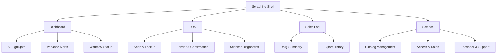
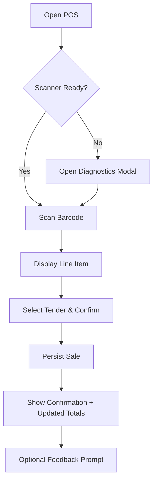
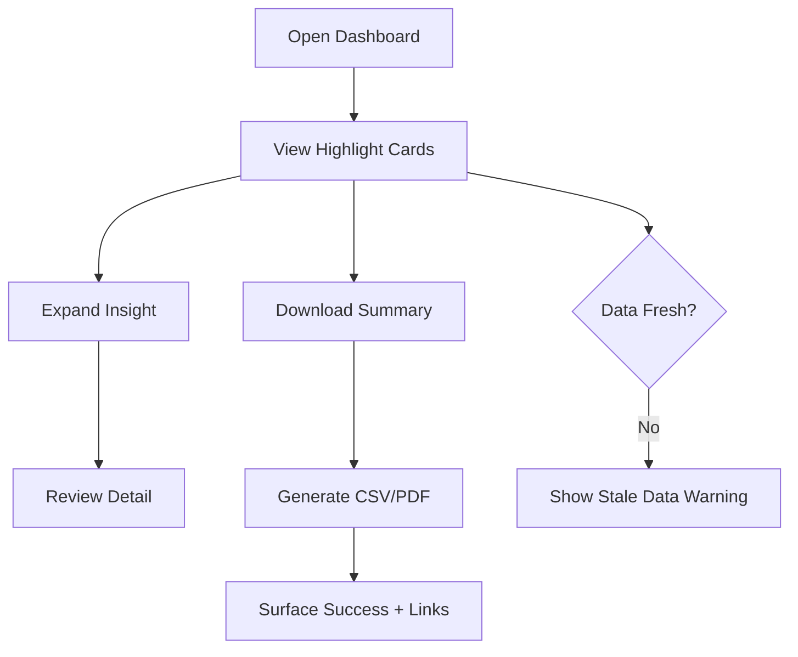
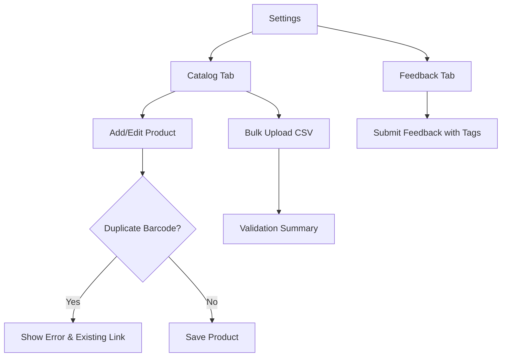

# Seraphine UI/UX Specification

## Introduction
Seraphine is delivering an internal MVP that focuses on two critical pilot experiences: capturing sales through barcode scanning and reviewing AI insights produced by an n8n workflow. This document translates the updated PRD into concrete UX guidance for the Next.js + Tailwind/shadcn stack so designers and engineers can move quickly without guesswork.

### Change Log
| Date       | Version | Description                                             | Author |
|------------|---------|---------------------------------------------------------|--------|
| 2025-10-23 | 0.2     | Aligned UX spec with internal MVP scope and new stack   | UX     |
| 2025-10-22 | 0.1     | Initial UX goals definition                             | UX     |

## Overall UX Goals & Principles

**Target User Personas**
- **Pharmacy Owner-Operator:** Reviews AI highlights daily, validates cash health, and shares feedback with the team.
- **Pilot Operations Lead:** Runs the POS workflow, registers sales via barcode, and validates data accuracy during the pilot.
- **Support Engineer / Developer:** Observes usage, diagnoses issues, and iterates on UI components based on internal feedback.

**Usability Goals**
- New pilot testers complete their first barcode-based sale (including tender confirmation) within 2 minutes of logging in.
- Dashboard renders AI highlights in under 2 seconds with clear freshness indicators.
- Exporting the daily sales summary takes no more than three clicks and completes in under 5 seconds.

**Design Principles**
1. **Focused Pilot Surface:** Show only the navigation items required for the MVP to reduce cognitive load.
2. **Transparent AI Insight:** Every AI highlight includes source, timestamp, and confidence context so testers trust the n8n output.
3. **Scanner-Friendly Interactions:** Inputs accommodate hardware scanners, large typography, and minimal pointer travel.
4. **Feedback Everywhere:** Lightweight prompts capture qualitative feedback without breaking user flow.

## Technical Alignment
- Next.js App Router renders both the dashboard and POS while server components and Route Handlers fetch data from Convex.
- Tailwind CSS and shadcn/ui provide the base component library; all new components should extend these primitives.
- Convex stores products, sales events, AI insights, and feedback submissions; queries are reactive where helpful.
- n8n writes AI insight records directly into Convex. The frontend treats these collections as read-only and never attempts to mutate them.
- Vercel hosts all environments; design assets should account for dark mode and deploy previews for quick review.

## Information Architecture

### Navigation Structure
- **Primary Navigation:** Vertical rail with Dashboard, POS, Sales Log, Settings. POS icon highlights when a scanner is detected. Dashboard is default landing for Owners; POS for Pilot Operators.
- **Secondary Navigation:** Within Settings, tabs switch between Catalog, Access, and Feedback utilities. Sales Log uses inline filters (date range, tender type, operator) rather than nested pages.
- **Breadcrumbs:** Only display inside Settings when navigating to a specific product or user; core workflow screens remain breadcrumb-free to reduce clutter.

## User Flows

### Flow 1 – Barcode Sale Capture
1. Operator arrives at POS screen; scanner status banner indicates “Ready” or shows troubleshooting link.
2. Scan barcode; system auto-focuses the hidden input and plays audio confirmation. Manual search is available via hotkey.
3. Line item appears with price, quantity controls, and tender method selection.
4. Operator adjusts quantity if needed and selects tender (cash, card, other).
5. Optional note field records context (e.g., discount, test sale).
6. Submission persists sale to Convex and shows toast confirmation; summary tile updates immediately.
7. Feedback micro-prompt appears after every fifth sale to capture operator sentiment.

### Flow 2 – Review AI Insights & Download Report
1. Owner logs in and lands on Dashboard summary cards.
2. Each card shows AI highlight (e.g., “Cash variance +MAD 420”), timestamp, and “Data source: n8n workflow run hh:mm”.
3. Owner can expand a card to see underlying transactions or contributing factors pulled from Convex.
4. “Download daily summary” button generates CSV/PDF via server action and shows progress indicator.
5. Post-download toast links to file location and offers quick share (copy URL, open folder).
6. Insight freshness badge warns if data is older than configurable threshold, linking to troubleshooting info.

### Flow 3 – Manage Catalog & Submit Feedback
1. Owner navigates to Settings › Catalog to add or edit product records required for barcode scans.
2. “Add product” dialog captures barcode, name, price, tax class, and optional note.
3. Duplicate barcode detection surfaces inline error with link to the existing product.
4. Bulk upload accepts CSV template with validation summary before commit.
5. After adjustments, owner can jump to Feedback tab to submit overall impressions or log issues.
6. Feedback form auto-tags the originating screen, includes a quick sentiment selector, and supports optional screenshot upload (internal only).

## Component Library & Design System
- Base layout, navigation rail, cards, tables, dialogs, toasts, and form elements extend shadcn/ui components styled with Seraphine Tailwind tokens.
- Scanner diagnostics modal uses accent color to communicate status (green ready, amber degraded, red disconnected) with concise troubleshooting steps.
- Insight cards adopt a two-column layout on desktop and stack vertically on tablet; each card reserves space for timestamp, confidence badge, and quick actions.
- Feedback prompts rely on non-blocking toasts or inline banners; they should never interrupt POS flow if the operator dismisses them.
- Storybook (or similar) must include states for light/dark mode, loading, empty, error, and stale data.

## States & Edge Cases
- **Scanner disconnected:** POS shows persistent warning, disables “Complete sale” button, and links to troubleshooting modal; manual entry remains available.
- **n8n data stale:** Dashboard cards dim, display “Last updated hh:mm”, and provide retry CTA routed to operations workflow.
- **Offline mode:** If connectivity drops, queue sales locally, display badge with queued count, and allow replay once online.
- **Permission denied:** Users lacking Owner role see read-only dashboard and cannot access Settings › Access; provide CTA to request access.
- **Feedback throttling:** Prevent multiple submissions within 60 seconds to avoid spam while testing.

## Accessibility & Localization
- Maintain French-first copy with English fallback in translation files; all primary labels must ship in French for the MVP.
- Ensure barcode workflow remains fully keyboard-accessible (no reliance on mouse), with focus traps tested.
- Adhere to WCAG 2.1 AA for color contrast and provide screen-reader-friendly labels for insights and totals.
- Motion-reduced mode disables celebratory animations after successful sales.

## Data & Integration Notes
- Dashboard reads from Convex collections populated by the n8n workflow; no UI component should attempt to modify those documents.
- POS actions write directly to Convex using authenticated mutations; responses update dashboard via reactive queries.
- Report downloads run through server actions that stream CSV/PDF and log completion events.
- Feature flags for pilot experiments can be managed through Convex documents read at runtime; no third-party flag service is required for MVP.

## Open Questions & Next Iterations
- Should we display per-user performance metrics (e.g., scans per hour) during the pilot, or keep insights aggregate-only?
- Do internal testers need mobile/tablet-specific layouts in the first sprint, or will desktop with responsive adjustments suffice?
- What retention rules should apply to feedback submissions once the pilot concludes?
